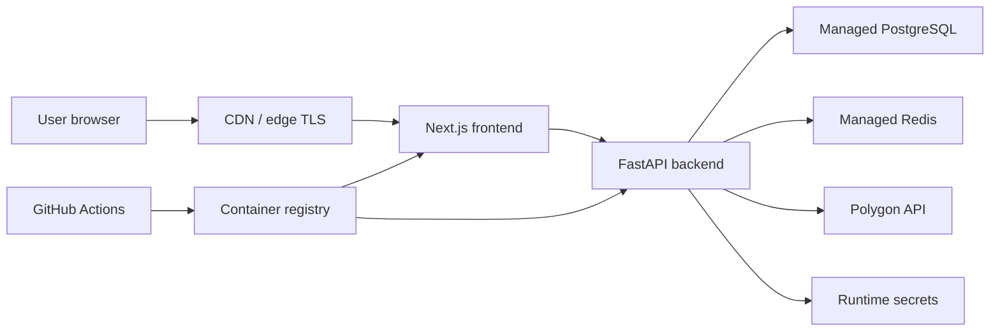

# Production Architecture

## Current Architecture
Next.js frontend calls the FastAPI backend. FastAPI uses provider interfaces for market data and news, with mock and Polygon adapters behind configuration. The recommendation engine combines snapshot signals and sentiment into a rules-based recommendation.

## Backend Layers
- API routes: request/response boundaries
- Services: business logic
- Providers: external data source integrations
- Repositories: database access
- Models: SQLAlchemy tables
- Agents: MCP/agentic tool wrappers and audit foundations

## Data Source Strategy
Provider interfaces isolate external APIs from application logic. Mock providers remain available for local development and CI. Polygon is the primary production provider path for market snapshots, reference data, technical indicators, aggregate candles, top movers, and ticker news.

## Target Shape
The production target is a containerized web application with managed persistence, managed cache, explicit secret injection, and CI/CD gates before release.

## AWS Baseline
- Frontend: CloudFront plus S3 for static export, or ECS service if server-rendered runtime is required.
- Backend: ECS Fargate service behind an application load balancer.
- Database: RDS PostgreSQL with private subnets, automated backups, and migration execution during deploy.
- Cache: ElastiCache Redis in private subnets.
- Secrets: AWS Secrets Manager injected into ECS tasks or mounted into the runtime secret adapter.
- Images: ECR repositories for backend and frontend images.
- CI/CD: GitHub Actions build, test, security scan, image push, and deploy promotion.

## Release Gates
- Backend tests and Ruff lint pass.
- Frontend lint and production build pass.
- Dependency scans pass for Python and frontend dependencies.
- Container scans pass for high/critical fixed vulnerabilities.
- Required runtime settings are present for the selected environment.

## Open Decisions
- Whether the frontend should be static-exported to S3/CloudFront or run as a container for dynamic Next.js routes.
- Identity provider selection for JWT issuer, audience, and JWKS configuration.
- Whether production orchestration should start on ECS Fargate or Kubernetes.
